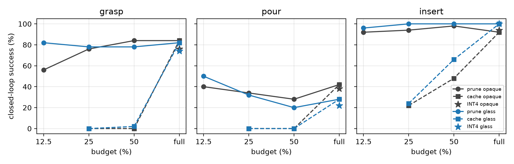

# ClearVLA: do VLA speed-ups fail on transparent lab objects?

**Pre-registered answer: no.** Token pruning, cross-observation token caching and INT4 weights cost the same task success on glass as on opaque lab objects at every usable budget. What the study found instead, on 6,100 paired closed-loop episodes with a from-scratch 30 M-parameter VLA:

1. **Attention-ranked pruning keeps the object's patches at chance and it barely matters** down to a 25 % budget: by layer 2 the object's information has left the visual tokens. An oracle that protects the object changes nothing.
2. **Pixel-change token caching is catastrophic for a frozen-ViT policy** (0 % grasp and pour at 50 %, 25 %, and with a feature-change criterion): patches whose pixels do not move still have tokens that do (cosine 0.81 to the previous frame). Material-independent.
3. **None of the methods reduces latency** on an L4 or an M5 Pro; the vision encoder and the iterative action expert dominate and eager execution is launch-bound.
4. The one significant material effect (12.5 % budget) is the reverse of the hypothesis: opaque grasp −28 pts, glass unchanged.

Full report: [docs/report.md](docs/report.md). Blog draft: [docs/blog.md](docs/blog.md). Weekly logs with every decision and incident: [CHECKPOINT.md](CHECKPOINT.md), `docs/week*_report.md`.



## What is here

| Path | Contents |
|---|---|
| `envs/`, `experts/`, `render/` | MuJoCo scenes built per seed (paired opaque/glass), scripted liquid, scripted experts, in-process Blender Cycles bridge |
| `data/` | demo recorder (clean + DART recovery), renderer, SigLIP feature cache, LeRobot export |
| `model/`, `train.py`, `configs/` | Model A: frozen SigLIP → 6-layer prefix → 4-layer flow-matching expert, with attention/KV hooks |
| `accel/` | Prune (FastV-style), Cache (VLA-Cache-style, pixel or feature change), fake INT4, Protect oracle, analytic FLOPs |
| `eval/` | paired closed-loop evaluator; SmolVLA wrapper |
| `analysis/` | H1 recall, matrix statistics (paired bootstraps), figures, latency |
| `jobs/` | Modal jobs: SmolVLA fine-tune (H100), TensorRT latency (L4) |
| `results/` | every episode log (JSONL), reports, figures |
| `PLAN.md` | the pre-registered design, hypotheses and the decisions log |

## Reproduce

See [scripts/reproduce.md](scripts/reproduce.md). The analysis-only path (all tables and figures from the committed logs) runs in minutes:

```
conda create -n clearvla python=3.11 && conda activate clearvla && pip install -r requirements.txt
python analysis/h1_recall.py --report && python analysis/matrix.py --out results/week5 && python analysis/matrix.py --out results/week6 && python analysis/figs.py --figs 2,3,5
```

Dataset (LeRobot v3, 2,700 episodes, two views): [yogyamehrotra/clearvla-sim](https://huggingface.co/datasets/yogyamehrotra/clearvla-sim). Checkpoint: [yogyamehrotra/clearvla-model-a-v4](https://huggingface.co/yogyamehrotra/clearvla-model-a-v4) (put `best.pt` and `norm.json` in `checkpoints/v4/`).

## License

Code: MIT ([LICENSE](LICENSE)). Dataset and checkpoint: CC BY 4.0 ([LICENSE-DATA](LICENSE-DATA)).
