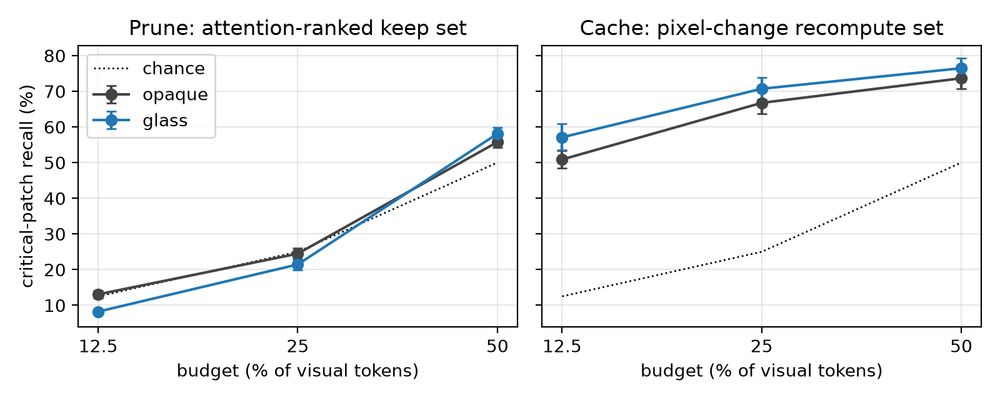
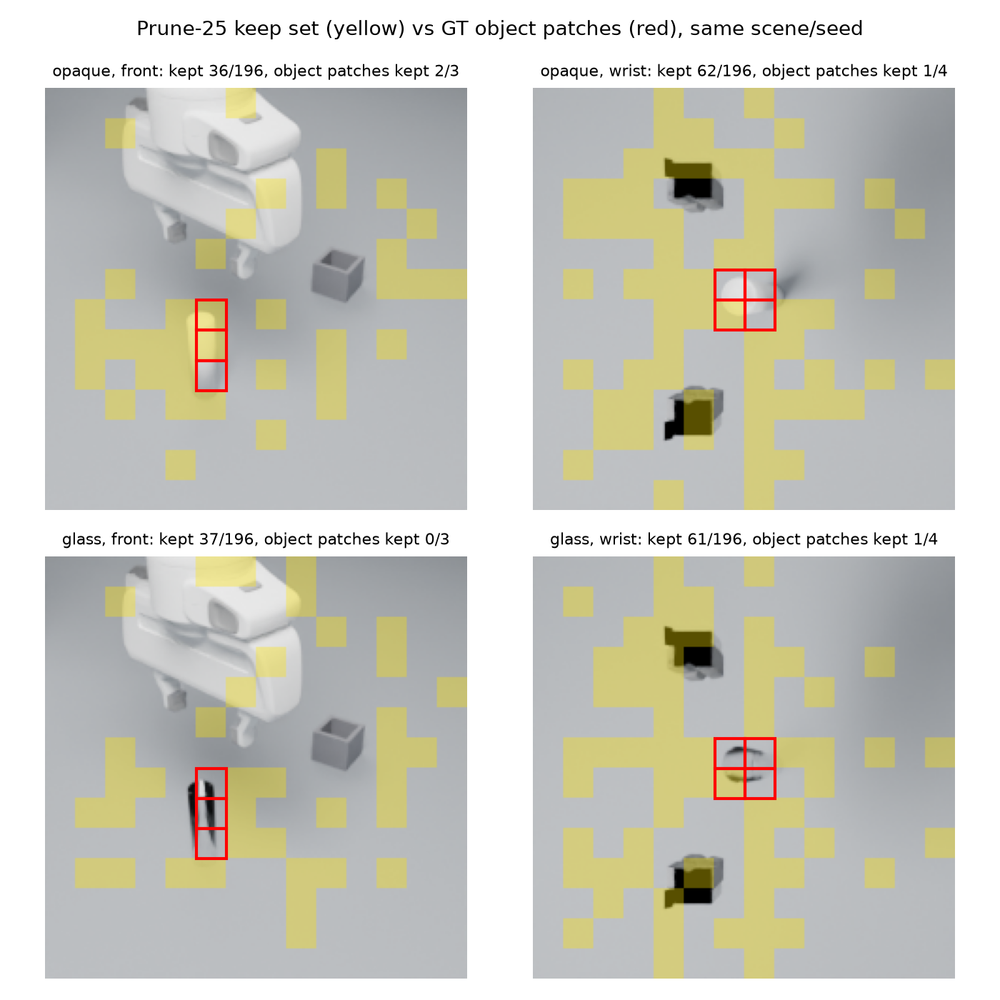
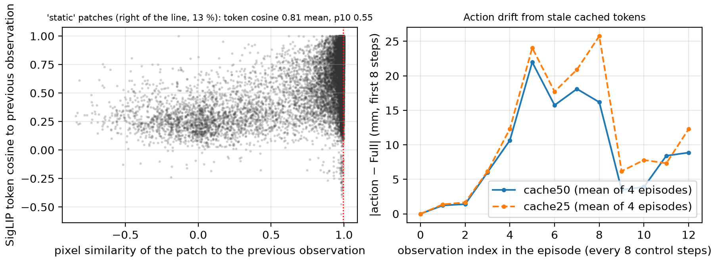

# ClearVLA: do VLA speed-ups fail on transparent lab objects?

**Yogya Mehrotra** · September 2026 · code: [github.com/yogyam/clearvla](https://github.com/yogyam/clearvla) · data: [yogyamehrotra/clearvla-sim](https://huggingface.co/datasets/yogyamehrotra/clearvla-sim) · model: [yogyamehrotra/clearvla-model-a-v4](https://huggingface.co/yogyamehrotra/clearvla-model-a-v4)

## Abstract

Vision-language-action (VLA) policies are being accelerated with visual-token pruning, cross-observation token caching and low-bit weight quantization, and evaluated almost exclusively on opaque tabletop objects. Laboratory manipulation is dominated by glass. This study asks a pre-registered question: do these accelerations cost disproportionately more task success on transparent objects than on opaque ones? We built paired simulated lab scenes in MuJoCo, rendered with Blender Cycles, where the same seed produces the same geometry with either an opaque or a glass test tube and beaker, three tasks (grasp-and-rack, pour-to-line, insert), a 30 M-parameter VLA trained from scratch on 2,700 scripted demonstrations, and four accelerations implemented inside it with identical weights: FastV-style pruning, VLA-Cache-style pixel-change K/V reuse, fake INT4 weights, and a ground-truth "protect" oracle. Across 3,400 paired closed-loop episodes with the final instrument, offline recall of the object's patches, and latency on an NVIDIA L4 and an M5 Pro, **the transparency hypotheses are not supported**: no method loses more success on glass than on opaque at the 25 % budget, quantization is material-neutral, and the one significant material effect, at a 12.5 % budget, runs the other way (opaque grasp −28 points, glass unchanged). What the study does establish is mechanistic and material-independent: (i) attention-based pruning keeps the task object's patches at chance level and yet costs almost nothing down to a 25 % budget, because the object's information has already left the visual tokens by layer 2; (ii) pixel-change caching is catastrophic for a frozen-ViT policy, since patches whose pixels do not change still have tokens that do (cosine 0.81 to the previous frame), and a feature-change criterion fails identically; (iii) none of the three methods reduces wall-clock latency on either device, where the vision encoder and the iterative action expert dominate. A fine-tuned 450 M SmolVLA on the same data underperformed the from-scratch model on every task and is reported as a negative result. Every number and figure is reproducible from committed episode logs.

## 1. Motivation and pre-registered hypotheses

Efficiency work on VLAs (surveyed in [12]) reports success retained under pruning [2, 3, 4], caching [1, 11] and quantization [10] on LIBERO, SIMPLER or VLABench, where objects are opaque, textured and well separated from the background. Lab robotics benchmarks [6, 7, 8] are full of glassware and name transparent liquids as an open problem, but do not touch acceleration. Two adjacent observations suggested a real gap: pruning papers note that "low-texture edges and narrow contact regions" are what gets dropped [3], and VLA-Cache's own ablation shows naive reuse of pixel-static tokens costing ten points because task-relevant regions that barely change get cached [1]. A glass tube is low-texture, thin, and changes few pixels as the arm approaches. The hypotheses were fixed before any model was trained (`PLAN.md` §2):

| ID | Claim | Supported if |
|---|---|---|
| H1 | Importance scores under-rank transparent regions | recall of the object's patches at 25 % budget: opaque − glass ≥ 10 pts, bootstrap CI excludes 0 |
| H2 (main) | Speed-ups cost more success on glass | at 25 %, retained success ≥ 15 pts lower on glass, CI excludes 0, on ≥ 2 of 3 tasks |
| H3 | Each method fails where its assumption fails | Cache hurts pour most; Prune hurts grasp most |
| H4 | Quantization is material-neutral | glass − opaque difference < 5 pts |
| H5 | Protecting instruction-referenced patches recovers the loss | ≥ 50 % of the transparency-specific drop recovered at ≤ 10 % extra compute |

The design included a decision gate: H1 is cheap and offline; if it failed, the closed-loop matrix would be run at a single budget with 50 paired episodes per cell instead of the full 5,400-episode design. It failed, and that is what was run.

## 2. Testbed

**Scenes.** Programmatic MuJoCo 3.13 scenes (Menagerie Franka Panda, damped-least-squares IK on a tool-centre-point site, gravity-compensated arm) built per episode from a seed: a bench, a test tube (r = 14 mm, h = 100 mm), and a rack, a holder, or a beaker with an inner fill mark. Randomisation per seed: object ±5 cm, receptacle ±3 cm, light intensity ±20 %, camera ±1 cm/±2°. The same seed under `opaque` and `glass` gives identical geometry, expert actions and segmentation masks; only the material differs, so every comparison is paired.

**Rendering.** Frames come from Blender 5.2 Cycles (Metal, 32 spp) driven in-process through `bpy`, rebuilding the geometry from MuJoCo's tables each episode. Glass uses a Cycles glass BSDF with transparent shadow rays, so the tube renders as faint refraction and a soft shadow rather than a silhouette. Two 224² views: a fixed diagonal camera and a wrist camera looking down the tool axis. Segmentation masks for the instruction-referenced objects come from MuJoCo's renderer and are pixel-aligned with the Blender frames.

**Tasks** (300 control steps at 10 Hz, success must hold 2 s): *grasp-and-rack* (tube within 1 cm of the slot, upright, released); *pour-to-line* (a scripted liquid model: fill rate proportional to tilt past 55°, liquid leaves from the lowest rim point of the mouth, any pour outside the beaker's inner wall is a spill; success = fill within ±10 % of the mark with no spill); *insert* (tube starts in the gripper; seat it in a 30 mm slot with 1 mm clearance). Eight material-neutral paraphrases per task ("put the tube in the rack", never "the glass tube"). A weld constraint attaches the tube when the gripper closes on it and releases it on open, because the Menagerie finger pads let a tilted tube wedge out during a 10 s pour; this removes grasp-slip noise from a perception study and is the same device used by several LeRobot simulation tasks.

**Demonstrations.** Scripted waypoint experts (99–100 % success on both materials, verified on 100 seeds per cell) recorded 300 clean episodes per task × material plus 150 recovery episodes per cell in the DART style (6 mm execution noise, clean labels). Every fourth control step was rendered: 2,700 episodes, 375 k frames, both views.

**Instrument (Model A).** A small VLA in the π0 / SmolVLA shape so that acceleration hooks are explicit: frozen SigLIP ViT-B/16 on each view (392 visual tokens) and a frozen SigLIP text encoder (64 tokens), a 19-D proprio token, a 6-layer d = 512 prefix transformer, and a 4-layer d = 384 flow-matching action expert that cross-attends to the prefix output and predicts a 16-step chunk of 10-D actions (xyz relative to the current tool position, 6-D rotation, gripper). 30.4 M trainable parameters; 35 k steps (9 h on an M5 Pro); 10 Euler steps at inference; execute 8 of 16 actions, then re-observe. The prefix runs once per observation and exposes every attention map and K/V. Two design changes were needed before the model was usable as an instrument, both found by closed-loop tracing: the wrist camera, and actions relative to the current tool position rather than absolute (a 10-pixel tube is below a SigLIP patch; relative targets turned grasp success from 35 % to 80 %).

**Validity gate.** 100 unseen paired seeds per cell: grasp 77 / 80 %, insert 98 / 99 %, pour 43 / 37 % (opaque / glass). Pour is below the 60 % bar the design set; its failures are spills at the spout, and the opaque beaker hides its fill level from every viewpoint but straight down, the study's only material effect on the *base* policy. We accepted pour as a weaker instrument rather than spend a fourth training cycle, and report it with that caveat.

**SmolVLA (negative result, Appendix A).** A fine-tuned SmolVLA (450 M, action expert trainable, 20 k steps on an H100, ≈ $8) on the same data reached grasp 53 / 48 %, pour 7 / 10 %, insert 52 / 50 %. It fits the demonstrations to 2 mm offline and fails closed-loop by approaching 3 cm off the tube. We did not pursue it further; the from-scratch model is the study's only instrument.

## 3. Acceleration methods

All four run inside Model A with identical weights (`accel/`). A budget *b* is the fraction of the 392 visual tokens (both views, ranked jointly) that gets full prefix compute after layer 2; layers 0–2, the text and proprio tokens, the frozen encoders and the action expert are never touched. This bounds the achievable FLOPs saving (37 % at b = 12.5 %) and is stated as such.

- **Prune** (FastV-style [2]): at layer 2, score each visual token by the attention it receives from the text and proprio queries; keep the top-*b* for layers 3–6.
- **Cache** (VLA-Cache-style [1]): compare each 16 × 16 pixel patch with the same patch in the previous observation (cosine similarity of raw pixels); recompute the *b* most-changed tokens through layers 3–6 and reuse the cached K/V and layer outputs for the rest; text and proprio tokens are always recomputed; the first observation of an episode is computed in full. The pixel-change criterion is the assumption under test. A **feature-change** variant ranks tokens by the change of their SigLIP feature vector instead.
- **Quant**: fake INT4 weights, symmetric, per group of 64 input channels, on all 84 linear layers of the prefix and expert (8.8 % relative weight error); activations fp16.
- **Protect** (H5 oracle): Prune or Cache, but tokens overlapping the simulator's segmentation of the instruction-referenced object (≥ 25 % of the patch) are always kept. An upper bound by construction.

Correctness checks: the 100 % variants of Prune and Cache reproduce the full model bit for bit; a static scene gives zero cache drift; action drift against the full model on demonstration observations is 0.5 / 0.9 / 1.2 mm median for Prune at 50 / 25 / 12.5 %, 0.8 mm for INT4, and 4.4 mm median (p90 22–26 mm) for Cache. Cost is counted analytically from the token counts each method actually uses, and latency is measured.

## 4. Results

### 4.1 H1: do importance scores under-rank glass? No, they under-rank everything.

Offline set: the scripted expert drives the 50 unseen seeds 1000–1049 of every task, under both materials, both views rendered at every observation point a policy would see: 2,623 observations per material, identical frames for every method and identical trajectories across materials. A patch is *critical* if ≥ 25 % of its pixels lie on the instruction-referenced object; recall is the fraction of critical patches in the keep set.

*Figure 3. Critical-patch recall vs budget. Prune (left) sits on the chance line for both materials; Cache (right) is above chance and higher for glass.*

| At 25 % budget | Opaque | Glass | Gap (opaque − glass), paired 95 % CI |
|---|---|---|---|
| Prune | 24.5 % | 21.5 % | +3.0 [+1.8, +4.2] |
| Cache | 66.8 % | 70.7 % | −3.9 [−4.5, −3.4] |

**H1 not supported** (bar: ≥ 10 pts). Prune keeps 24.5 % of the object's patches at a 25 % budget: exactly chance. Only 0.6–4.7 % of layer-2 attention from the text and proprio queries lands on the object at all. The glass tube receives about half the attention mass of the opaque one (2.1 % vs 4.7 % on grasp), which is the effect the hypothesis predicted, but it is small and concentrated in grasp (+8.0 pts at 25 %, +9.7 at 12.5 %). Figure 1 shows a typical scene.

*Figure 1. The same scene and seed under both materials; Prune-25 keep set in yellow, ground-truth object patches outlined in red. The opaque front view keeps 2 of 3 object patches, the glass front view 0 of 3; the wrist view keeps 1 of 4 in both.*

Cache goes the other way: the glass tube refracts the moving arm and background, so its patches change *more* pixels between observations and are recomputed more often (pour at 12.5 %: 70 % opaque vs 88 % glass). The design doc's premise for Cache (glass changes pixels less than it changes state) is not what the renders show.

### 4.2 H2–H5: closed-loop matrix

Six configurations × 3 tasks × 2 materials × 50 paired seeds (1,800 episodes, 5 h on the Mac), then three more budgets (900 episodes). Synchronous evaluation (the simulator pauses during inference), horizon 300, seeds 1000–1049.

| Success %, n = 50, opaque / glass | Grasp | Pour | Insert |
|---|---|---|---|
| Full | 84 / 82 | 42 / 28 | 92 / 100 |
| Prune-50 | 84 / 78 | 28 / 20 | 98 / 100 |
| Prune-25 | 76 / 78 | 34 / 32 | 94 / 100 |
| Prune-12.5 | **56 / 82** | 40 / 50 | 92 / 96 |
| Protect-prune-25 (oracle) | 80 / 76 | 46 / 26 | 90 / 96 |
| Cache-50 (pixel) | 0 / 2 | 0 / 0 | 48 / 66 |
| Cache-25 (pixel) | 0 / 0 | 0 / 0 | 22 / 24 |
| Cache-25 (feature) | 0 / 0 | 0 / 0 | 12 / 20 |
| Quant INT4 | 76 / 74 | 38 / 22 | 94 / 100 |

*Figure 2. Closed-loop success vs budget per task; circles Prune, squares Cache, stars INT4; black opaque, blue glass.*

Material diff-in-diff (change vs Full on opaque minus change on glass, paired over seeds, 95 % CI): Prune-25 grasp −4 [−26, +18], pour −12 [−34, +8], insert +2 [−6, +10]; Quant grasp 0 [−18, +18], pour +2 [−26, +28], insert +2 [−8, +12]; Prune-50 within ±6 with CIs spanning zero; Cache-25 pour −14 [−32, +4] (glass had less to lose); **Prune-12.5 grasp −28 [−52, −4]**, pour −24 [−48, 0].

- **H2 not supported.** At the pre-registered 25 % budget no method loses more on glass; every CI includes zero. With n = 50 the study excludes glass-specific losses of roughly 20 points or more, not smaller ones.
- **H3** has the pre-registered direction for Prune (its largest loss is on grasp) but the loss is small. Cache floors every task on both materials, so its task ordering is uninformative.
- **H4 supported**: INT4 costs the same on both materials within 2 points. (The pre-registered ratio metric, retained success, gives +12 on pour with a CI of [−75, +90], an artefact of dividing by a 28 % base rate; absolute differences are the interpretable statistic and are reported alongside.)
- **H5 not applicable**: there is no transparency-specific loss to recover. The oracle that keeps 100 % of the object's patches at the same budget lands within noise of plain Prune-25 on every cell, which is itself informative (§5.1).
- **A reversed effect at 12.5 %.** Opaque grasp falls by 28 points while glass does not move, and glass pour rises. This is the only significant material effect in the study and it is the opposite of H2. It is one budget, n = 50, and one of 18 comparisons; we report it as an observation. It is consistent with H1's numbers: at 12.5 % the keep set retains 13 % of the opaque tube's patches and 8 % of the glass tube's, yet only the opaque policy suffers, so success on glass at this budget cannot depend on the tube's own patches. A plausible reading is that the glass tube's evidence (shadow, refraction, the distorted background) is spread over more of the image than an opaque silhouette, and survives random-like pruning better.

### 4.3 Latency

Per observation, batch 1, median of 300 runs; the accelerated region is prefix + expert (10 Euler steps); SigLIP on two views is measured separately.

| NVIDIA L4 | Tokens after layer 2 | GFLOPs (rel.) | Eager fp16 | torch.compile + CUDA graphs | TensorRT fp16 |
|---|---|---|---|---|---|
| Full | 457 | 24.4 (1.00) | 64.8 ms | 5.44 ms | 5.51 ms |
| Prune-50 | 261 | 19.0 (0.78) | 65.3 | 5.17 | 5.72 |
| Prune-25 | 163 | 16.5 (0.68) | 64.1 | 4.88 | 5.82 |
| Prune-12.5 | 114 | 15.3 (0.63) | 64.1 | 4.67 | 6.05 |
| SigLIP, 2 views | — | ≈ 67 | 7.3 | 2.5 | — |

| Apple M5 Pro, MPS eager | SigLIP | Prefix | Expert | Total |
|---|---|---|---|---|
| Full | 27.8 ms | 4.5 ms | 18.9 ms | 51.4 ms |
| Prune-12.5 | 28.6 | 5.8 | 20.6 | 55.0 |
| Cache-25 | 28.7 | 5.6 | 20.8 | 54.9 |
| Quant INT4 (fake) | 28.8 | 4.8 | 20.7 | 54.2 |

Eager execution is launch-bound: 65 ms whatever the token count. Removing launch overhead (CUDA graphs or TensorRT) is a 12× speed-up by itself; after that, a 37 % FLOPs reduction buys 14 % latency under CUDA graphs and nothing under TensorRT. On the Mac the frozen vision encoder is 55 % of the observation time and the 10-step expert 37 %; the prefix the methods touch is 9 %, and pruning or caching add gather overhead rather than save time. For a model of this size at batch 1, none of the three methods is a latency lever.

## 5. What the study does establish

### 5.1 The object's information leaves the visual tokens early

Attention-ranked pruning keeps the object's patches at chance, and yet the policy loses almost nothing down to a 25 % budget, and protecting the object's patches with an oracle changes nothing. Both facts say the same thing: by layer 2 of a 6-layer prefix trained on this data, what the action expert needs about the object has been routed into the text and proprio tokens (and into whichever visual tokens happen to attend to it), so the later visual tokens are largely redundant. Pruning "works" here not by finding the object but because the object no longer needs finding after layer 2. This is a property of the trained model, not of the material, and it makes the H1 recall metric, which is where much of the pruning literature argues, a poor predictor of closed-loop success.

### 5.2 Static pixels are not static tokens

*Figure 4. Left: pixel similarity of a patch to the previous observation vs the cosine of its SigLIP token to the previous observation; 13 % of patches are pixel-static (right of the line) and their tokens still move (cosine 0.81 mean, p10 0.55). Right: action drift of Cache-50/25 against the full model along expert episodes.*

A ViT token depends on the whole image, not on its own pixels. Reusing K/V for pixel-static tokens therefore feeds the prefix stale features on every frame where anything moved, which in manipulation is every frame. The drift accumulates along the approach (1 → 23 mm over six observations at a 50 % budget), the arm arrives 2–3 cm off, and the tube is knocked over; 0 % on grasp and pour at 50 %, 25 % and with the feature-change criterion, on both materials. VLA-Cache's published version filters reuse by attention and reports ten points of loss from naive reuse [1]; in a policy that depends on a 10-pixel object, naive reuse is not a ten-point loss but a total one. Transparency never enters.

### 5.3 The instrument's material effect is in the task, not the acceleration

The only robust material difference in the base policy is pour (42 vs 28 %), and its cause is visible in the failure modes: the opaque beaker hides the liquid level, so the policy under- or over-shoots the mark; the glass beaker shows it. That effect is present at every budget and for every method equally.

## 6. Limitations

Simulated glass is easier than real glass: Cycles renders clean refraction with no sensor noise, no specular highlights from lab lighting, and no depth-sensor failure. The liquid is scripted, not simulated. The Protect oracle and the H1 masks use simulator segmentation. Evaluation is synchronous, so latency cannot affect success. The pour instrument is below the 60 % bar. n = 50 per cell bounds the detectable glass-specific loss at about 20 points. A single model seed and a single data regime were used; the reversed effect at 12.5 % is unreplicated. The FLOPs saving is bounded by design (37 %) because layers 0–2, the encoders and the expert are untouched; a method that prunes before the encoder would face the object-localisation problem this model side-steps. The sticky-gripper weld removes grasp-slip as a failure mode.

## 7. Related work

Token pruning for VLAs [2, 3, 4] descends from FastV [13] and reports success retained on LIBERO or SIMPLER at 25–50 % of tokens; VLA-IAP [3] measures retention of gripper-object boundary tokens, the closest mechanistic argument to H1, but never varies material. VLA-Cache [1] and its learned successor [11] reuse K/V of static tokens with an attention filter; its ablation of naive reuse is the closest published point to our §5.2. Weight quantization for VLAs [10] reports W4A4 and sub-4-bit post-training quantization with closed-loop error compounding; our H4 result agrees that 4-bit weights are benign for this model. "Pruning Breaks VLA Models" [9] finds the vision backbone far more fragile than the language model under weight pruning; our finding that the object's information leaves the visual tokens by layer 2 is the token-side counterpart. On the transparency side, SEVO [5] grasps transparent bottles with active illumination and never compares with opaque objects; LabVLA [6], AutoBio [7] and LabUtopia [8] build lab benchmarks with glassware and name transparent liquids as a gap, without acceleration. Robustness suites [14] vary colour, texture, lighting and distractors but not transparency and not accelerated models. To our knowledge no prior work evaluates an acceleration method as a function of object transparency; this study does, and finds the effect absent at the budgets where the methods are usable.

## 8. Reproducibility

All 6,300 closed-loop episodes (3,400 with the final instrument) are committed as JSONL under `results/` with per-observation keep sets, GT-patch recall and FLOPs; `scripts/reproduce.md` maps every table and figure to one command, and the analysis-only path runs in minutes without a simulator. The dataset (LeRobot v3, 2,700 episodes, both views, CC BY 4.0) and the Model A v4 checkpoint are on the Hugging Face Hub. Total compute: about 46 h of M5 Pro time for the instrument, 14 h for the matrices, and $9 of cloud GPU.

## Appendix A. SmolVLA as a second instrument

`lerobot/smolvla_base` fine-tuned on the same 2,700 episodes (cameras mapped to its `camera1`/`camera2` slots, 224² frames padded to 512², actions as per-frame deltas because the LeRobot format stores one action per frame; 20 k steps, batch 64, H100, 101 min; only the 100 M-parameter action expert trainable, lerobot's default). Gate, 100 seeds per cell: grasp 53 / 48 %, pour 7 / 10 %, insert 52 / 50 % (opaque / glass), versus 77 / 80, 43 / 37, 98 / 99 for Model A v4. Offline the fine-tuned model reproduces the demonstrations to 2.0 / 1.9 / 2.6 mm per axis with correct gripper timing; closed loop it descends 3 cm to the side of the tube without correcting laterally. Re-observing every 4 or 2 steps did not help. We attribute the gap to the frozen web-pretrained VLM (64 visual tokens per 512² image) and the per-frame delta convention, and did not spend further budget on it. All logs are in `results/smolvla/`.

## Appendix B. Every closed-loop measurement

`results/week3/*/gate_report_full.md` (instrument gates v1–v4), `results/week5/matrix_report.md` (Table 2 with CIs and the ratio-based diff-in-diff), `results/week6/matrix_report.md` (budget curves), `results/week4/h1_report.md` (H1 per view and per task), `results/week7/*.json` (latency), `docs/week*_report.md` (weekly reports with incidents and decisions).

## References

1. Xu et al., VLA-Cache: Efficient VLA Manipulation via Adaptive Token Caching, NeurIPS 2025 (arXiv 2502.02175).
2. VLA-Pruner: Bridging the Semantic-Action Gap in Visual Token Pruning, arXiv 2511.16449.
3. VLA-IAP: Training-Free Visual Token Pruning via Interaction Alignment, arXiv 2603.22991.
4. EfficientVLA, arXiv 2506.10100.
5. SEVO: Semantic-Enhanced Virtual Observation via Active Illumination, arXiv 2605.11114.
6. LabVLA: Grounding VLAs in Scientific Laboratories, arXiv 2606.13578.
7. AutoBio, ICLR 2026 (arXiv 2505.14030).
8. LabUtopia, arXiv 2505.22634.
9. Don't Run with Scissors: Pruning Breaks VLA Models, arXiv 2510.08464.
10. QuantVLA (2602.20309); Omega-QVLA (2605.28803); ActQuant (2605.24011); HBVLA (2602.13710).
11. Learning to Accelerate VLAs through Adaptive Visual Token Caching, arXiv 2602.00686.
12. A Survey on Efficient VLA Models, arXiv 2510.24795.
13. Chen et al., An Image is Worth 1/2 Tokens After Layer 2 (FastV), ECCV 2024.
14. Colosseum V2 (2605.27759); LIBERO-Plus (2510.13626); VLATest.
15. Shukor et al., SmolVLA, 2025; Black et al., π0, 2024; Zhai et al., SigLIP, ICCV 2023.
